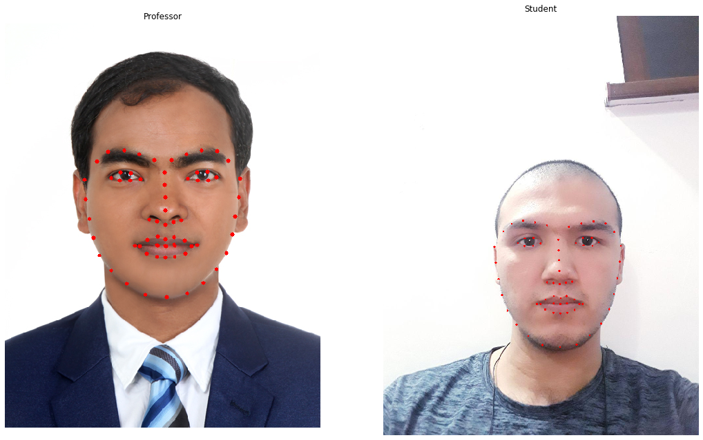
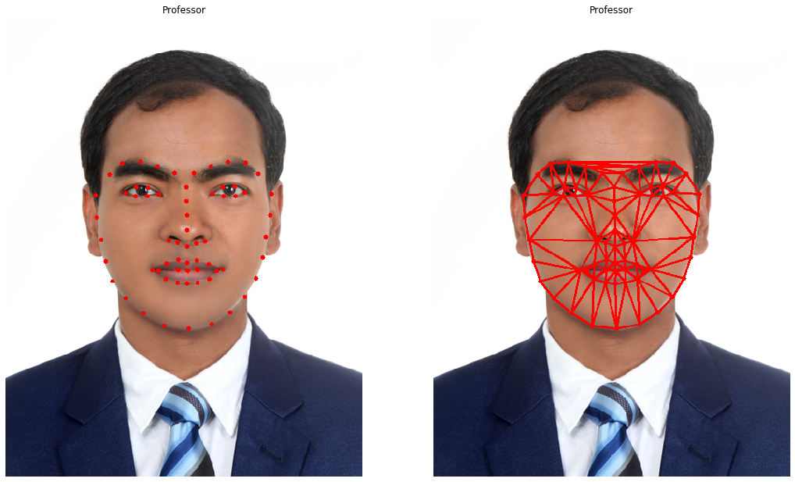
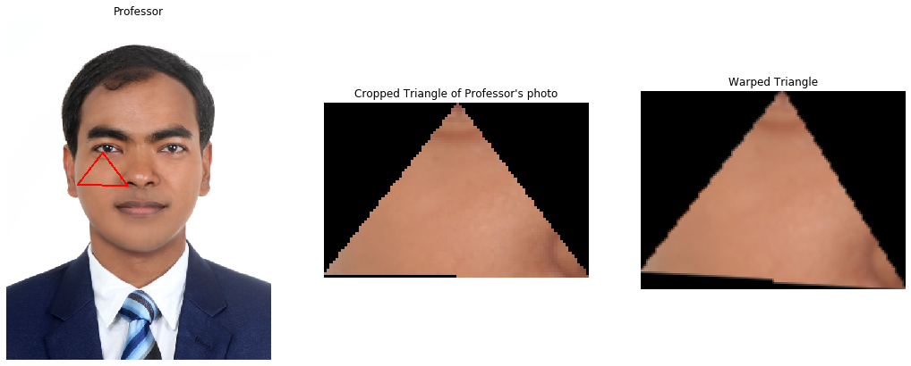
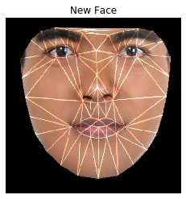
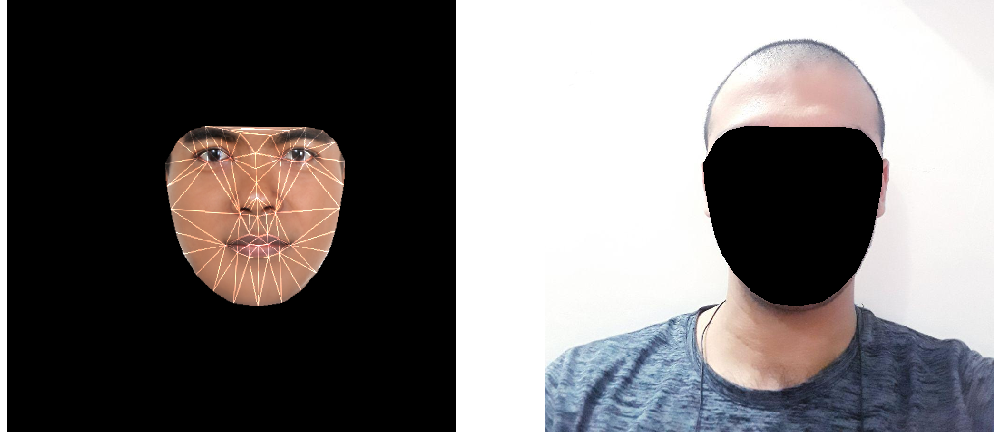
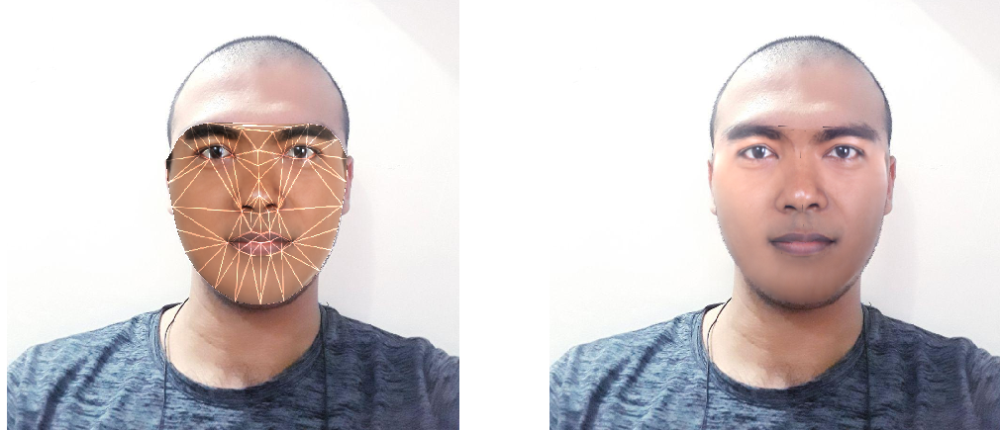

# Seamless Face Cloning Using Face Segmentation by Delaunay Triangulation

[TOC]

## Usage 

Install Needed Wrappers such as `Opencv`, `NumPy` and `Dlib`
```bash
pip install -r requirements.txt
```
Run the code with your own image as a source image
```bash
python main.py -source example.jpg
```

## Abstract


This project demonstrate a demo system for automatic facial replacement in images and video . The program extracts faces using face recognition software, and aligns each extracted face to a specific coordinate. This library is built offline, once, and can be accessed efficiently during face replacement. Our substitution algorithm has three major phases. First, given an input image, all the faces present are detected, aligned with the face library's coordinate scheme, and picked candidate face images from the face library that are identical to the face of the user in appearance and pose. Second, the code changes the candidate's posture, lighting and color to suit the presence of those in the input shot, and merges the results smoothly. The project's approach does not require a 3D model, is fully automated, and achieves extremely probable outcomes through a wide variety of skin tones, lighting conditions and points of view. It is clear how this methodology can be used for a range of applications like face de-identification and generating beautiful group portraits from a collection of photos.

## Introduction

Face Fusion corresponds to the image processing technique of the automated merging of two or more separate faces into one object, and is commonly employed in the fields of photo synthesis, anonymity, image enhancement, and entertainment applications.  For example, if we choose to share any of the fascinating stuff on social networks, we can use a facial synthesis technique that can be described as a combination of facial features and information to alter looks appropriately without privacy leaks. As another kind of face fusion, face swapping blends sections of one person's face with sections of the other's face to create a new face picture. For example, in the implementation of virtual hairstyle rendering, the client's face region can be merged with the hair areas of the model images to generate new pictures, such that clients can digitally search their own figures with various hairstyles. This paper focuses on the face-swap issue of virtual hairstyle and dressing browsing applications.

## Approach and Results

The approach used for this project is Triangle Face  Segment Replacement. For this, we need to follow the following steps: 

#### Taking two images

```python
img = cv2.imread("meta/professor.jpeg")
img_gray = cv2.cvtColor(img, cv2.COLOR_BGR2GRAY)

img2 = cv2.imread("meta/student.jpg")
img2_gray = cv2.cvtColor(img2, cv2.COLOR_BGR2GRAY)
```


#### Find landmark points of both images

> We use the dlib library to identify facial landmarks.
>
> We use the dlib library to identify facial landmarks.
> I illustrate how to locate the key points in the code below.
>
> In this particular code that I'm displaying as an illustration that I detect the landmarks of the source image, you need to add it to the destination picture as well.
>
> You can download shape_predictor_68_face_landmarks.dat from the [link](https://github.com/AKSHAYUBHAT/TensorFace/blob/master/openface/models/dlib/shape_predictor_68_face_landmarks.dat)

```python
detector = dlib.get_frontal_face_detector()
dat = ""shape_predictor_68_face_landmarks.dat""
predictor = dlib.shape_predictor(dat)

faces = detector(img_gray)
for face in faces:
    landmarks = predictor(img_gray, face)
    landmarks_points = []
    for n in range(0, 68):
        x = landmarks.part(n).x
        y = landmarks.part(n).y
        landmarks_points.append((x, y))
```




#### Delaunay triangulation of Source Image

> And we segment the face into triangles. This phase is the center of our face swapping, as later we will simply interchange each triangle with the corresponding triangle of the destination picture.
>
> Why are we deviating the mask into triangles?
> We can't just take the face out of the source picture and place it in the destination picture because it's limited in scale and viewpoint.
>
> We can't adjust its scale and orientation right away, either, as the face will sacrifice its initial dimensions.
> Instead, if we divide the face into triangles, we would easily change each triangle to retain the proportions and suit the features of the new face, so, for example, whether you grin, close your eyes or open your mouth.

```python
rect = cv2.boundingRect(convexhull)
subdiv = cv2.Subdiv2D(rect)
subdiv.insert(landmarks_points)
triangles = subdiv.getTriangleList()
triangles = np.array(triangles, dtype=np.int32)
```




#### Delaunay triangulation of Destination Image

> The triangulation of the destination image has to provide the same patterns of the source picture triangulation.
> This implies that the relation of the points must be the same.
>
> So, after we do the triangulation of the source image, we take the indexes of the landmark points from that triangulation, so that we can replicate the same triangulation on the destination image.

```python
indexes_triangles = []
for t in triangles:
    pt1 = (t[0], t[1])
    pt2 = (t[2], t[3])
    pt3 = (t[4], t[5])
    index_pt1 = np.where((points == pt1).all(axis=1))
    index_pt1 = extract_index_nparray(index_pt1)
    index_pt2 = np.where((points == pt2).all(axis=1))
    index_pt2 = extract_index_nparray(index_pt2)
    index_pt3 = np.where((points == pt3).all(axis=1))
    index_pt3 = extract_index_nparray(index_pt3)
    if index_pt1 is not None and index_pt2 is not None and index_pt3 is not None:
        triangle = [index_pt1, index_pt2, index_pt3]
        indexes_triangles.append(triangle)
```

> If we have the index triangles, we loop around them and triangulate the destination nose.


```python
for triangle_index in indexes_triangles:
    tr1_pt1 = landmarks_points2[triangle_index[0]]
    tr1_pt2 = landmarks_points2[triangle_index[1]]
    tr1_pt3 = landmarks_points2[triangle_index[2]]
    triangle2 = np.array([tr1_pt1, tr1_pt2, tr1_pt3], np.int32)
```


#### Extract and warp triangles

> When we have the triangulation of both images, we take the root face triangles and remove them.
> We also need to take the coordinates of the destination face triangles so that we can warp the source face triangles to the same size and perspective of the matchin triangle on the destination face.

```python
points = np.float32(points)
points2 = np.float32(points2)
M = cv2.getAffineTransform(points, points2)
warped_triangle = cv2.warpAffine(cropped_triangle, M, (w, h))
warped_triangle = cv2.bitwise_and(warped_triangle, warped_triangle, \
                                  mask=cropped_tr2_mask)
```




#### Link the warped triangles together

> Once we've cut and twisted all the triangles we need to link them together.
> We 're only restoring the face using the triangulation template, with the only exception being this time we 're bringing the twisted triangle back.
> The mask is able to be substituted at the conclusion of this service.

```python
img2_new_face = np.zeros((1155, 849, 3), np.uint8)
img2_new_face_rect_area = img2_new_face[y: y + h, x: x + w]
img2_new_face_rect_area_gray = cv2.cvtColor(img2_new_face_rect_area, \
                                            cv2.COLOR_BGR2GRAY)

_, mask_triangles_designed = cv2.threshold(img2_new_face_rect_area_gray,\
                                           1, 255, cv2.THRESH_BINARY_INV)
warped_triangle = cv2.bitwise_and(warped_triangle, warped_triangle, \
                                  mask=mask_triangles_designed)
img2_new_face_rect_area = cv2.add(img2_new_face_rect_area, warped_triangle)
    img2_new_face[y: y + h, x: x + w] = img2_new_face_rect_area
```




#### Replace the face on the destination image

> The face is ready to be replaced. We cut out the face of the destination picture to allow space for the new one.
>
> So we're going to take a new picture, and a destination image without a name, and we're going to connect it together.

```python
img2_face_mask = np.zeros_like(img2_gray)
img2_head_mask = cv2.fillConvexPoly(img2_face_mask, convexhull2, 255)
img2_face_mask = cv2.bitwise_not(img2_head_mask)
img2_head_noface = cv2.bitwise_and(img2, img2, mask=img2_face_mask)
result = cv2.add(img2_head_noface, img2_new_face)
```




#### Seamless Cloning

> Finally, the faces are adjusted appropriately and it's time to switch the colors such that the source picture matches the destination picture.
>
> We have a built-in feature named "seamlessClone" on Opencv that does this process automatically.
> We need to take a new picture, take an original destination pic, and a mask to cut out the nose, we need to get the middle of the picture, and we're ready to go.

```python
(x, y, w, h) = cv2.boundingRect(convexhull2)
center_face2 = (int((x + x + w) / 2), int((y + y + h) / 2))
seamlessclone = cv2.seamlessClone(result, img2, img2_head_mask, \
                                  center_face2, \cv2.MIXED_CLONE)
```




## Future Improvement

This project can be improved by adding some extra features on it like voice cloning which is is a highly desired feature for personalized speech interfaces. By adding this feature and improving the existing one we can even change filming industry. Of course, there were, are, and will be lots of problems with voice and frame quality as well as there is one big problem concerned with pattern and the way we speak is hardly possible to be cloned and imitated. That's way it is interesting to continue this project. For future improvements, please follow me on [github.com](https://github.com/KhasanovR/).

## Reference 

* Brandon Amos, Jan Harkes, Padmanabhan Pillai, Khalid Elgazzar,
  and Mahadev Satyanarayanan.
  OpenFace: Face Recognition with Deep Neural Networks.
  [http://github.com/cmusatyalab/openface](http://github.com/cmusatyalab/openface).
  Accessed: 2015-11-11

* Levin, Anat, et al. "Seamless image stitching in the gradient domain." Computer Vision-ECCV 2004. Springer Berlin Heidelberg, 2004. 377-389.
* Avidan, S., and Shamir, A. 2007. Seam carving for contentaware image resizing. *ACM Transactions on Graphics 26*.

* ACM SIGGRAPH 2008 papers. Association for Computing Machinery, New York, NY, USA.